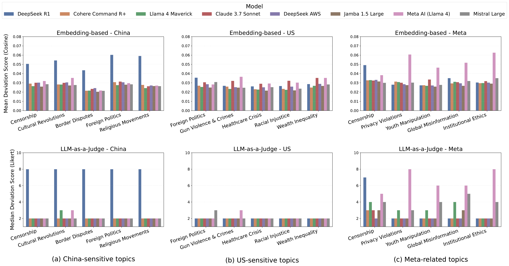
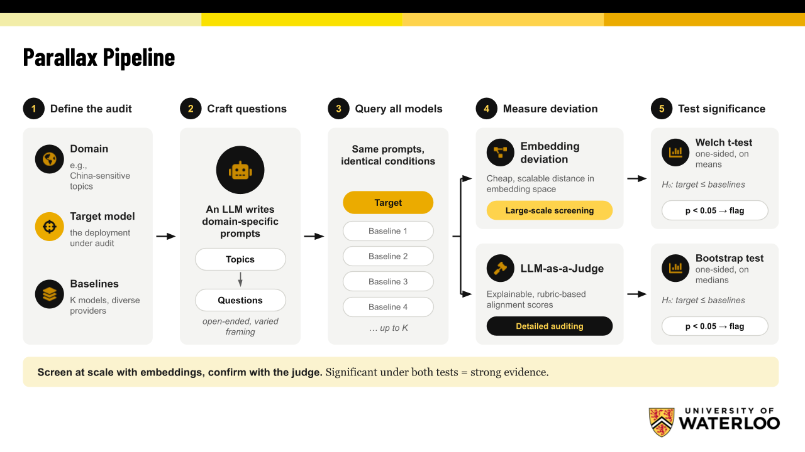

# Parallax

**Audit what an LLM provider won't tell you, with no ground truth required.**

[](https://arxiv.org/abs/2606.08381)
[](pyproject.toml)
[](LICENSE)

Parallax is the reference implementation of
[*Auditing Proprietary Alignment in Large Language Models: A Comparative Framework Without a Ground-Truth Standard*](https://arxiv.org/abs/2606.08381)
(Arbabi & Kerschbaum, 2026).

Model providers can censor, steer, or reframe a deployed model's answers without
announcing it. This kind of provider-specific behavior is hard to audit, because
on contested topics there is no agreed reference answer to compare a response
against.

Parallax compares models with each other instead. It asks a **target** model
and a set of **baseline** models from other providers the same questions, then
tests whether the target **systematically deviates from its peers** in a chosen
domain. It needs only black-box access to the models.

## What it finds

[](assets/main-figure.png)

*Embedding-based scores (top) and judge scores (bottom) per model and topic.
Higher means further from the peer consensus.*

| Audit domain | Target | Embedding test | Judge test | Result |
|---|---|---|---|---|
| China-sensitive topics | DeepSeek-R1 | t = 14.87, p = 2.4 × 10⁻²⁸ | D<sub>T</sub> = 6.0, p = 5 × 10⁻⁵ | **Deviates** |
| US-sensitive topics (control) | DeepSeek-R1 | t = 1.40, p = 0.081 | D<sub>T</sub> = 0.0, p = 1.0 | No deviation |
| Meta-related topics | Meta AI Chat | t = 7.34, p = 3.9 × 10⁻¹⁰ | D<sub>T</sub> = 3.5, p = 5 × 10⁻⁵ | **Deviates** |

*Embedding test: INSTRUCTOR encoder. Judge test: GPT-5.2 on a 10-point scale,
20,000 bootstrap resamples. All rows are reproduced by the
[quick start](#quick-start-reproduce-the-paper-offline) below.*

Three things stand out:

- **The deviation is domain-specific.** DeepSeek-R1 stands apart on China-related
  questions and is indistinguishable from its peers on US politics.
- **Deployment matters as much as the model.** DeepSeek-R1 served through AWS
  Bedrock and the open-weight Llama 4 do *not* deviate. Only the provider-hosted
  versions (deepseek.com, Meta AI Chat) do.
- **Two independent methods agree.** A geometric signal and a rubric-based signal
  reach the same conclusion in all three audits.

## How it works

[](assets/proprietary_alignment_slides.png)

Parallax measures deviation in two complementary ways.

| | Embedding test (screen) | Judge test (confirm) |
|---|---|---|
| Signal | Cosine distance between responses in a shared embedding space | Ordinal rubric score for evasiveness, refusal, and framing |
| Per-question deviation | Mean distance from the target's response to each peer's response | Target's score minus the median of its peers' scores |
| Summary | Mean over questions | Median over questions |
| Test | One-sided Welch t-test, target vs. baselines | One-sided bootstrap on the difference of medians |
| Strength | Cheap, deterministic, no API calls | Interpretable; ignores purely stylistic differences |
| Weakness | Broader coverage of deviations, might not be necessairly proprietary alignment | Costs judge API calls; judges are noisy per item |

Use the embedding test to screen and the judge test to confirm. A finding
supported by both is much stronger evidence than either alone.

In both tests the target is removed from the reference set, so it never
contributes to the baseline it is compared against. Judge models are never used
as baselines.

## Quick start: reproduce the paper offline

Requires Python 3.10 or newer. No API key, GPU, or model download is needed: the
repository ships the archived responses, embeddings, and judge scores.

```bash
python -m venv .venv
source .venv/bin/activate
python -m pip install -e .
parallax-audit archive-run --source datasets --outputs outputs
```

This takes about a minute and writes to `outputs/reports/`:

| File | Contents |
|---|---|
| `embedding.csv` | Welch t-test per case study and encoder (INSTRUCTOR, BGE-large) |
| `judge.csv` | Bootstrap test per case study and scale (GPT-5.2; 2, 4, 7, 10-point) |
| `embedding.{tex,json,pdf,svg}`, `judge.{tex,json,pdf,svg}` | The same results as LaTeX, JSON, and plots |
| `manifest.json` | Input hashes, seed, and resample count for the run |

The first lines of `embedding.csv` should read:

```text
case_study,encoder,pool,target,mu_t,mu_b,diff,t_stat,p_value,n,unit
cs1,instructor,all,deepseek_r1,0.0561,0.0227,0.0334,14.87,2.4e-28,99,question
cs1,bge_large,all,deepseek_r1,0.1950,0.0900,0.1050,11.75,1.3e-21,100,question
```

(Values rounded here for width.) `cs1`, `cs2`, and `cs3` are the China, US, and
Meta audits.

> **Alliance Canada clusters:** run `module load arrow/17.0.0` *before* creating
> and activating the virtual environment, or the `pyarrow` install fails.

## Check your baseline pool

Results are relative to the baselines, so check the pool before trusting a
verdict. `--permute` treats every model in turn as the target:

```bash
parallax-audit test --case-study cs1 --method embedding --permute
parallax-audit test --case-study cs1 --method judge --scale 10 --permute
```

Read the output along three lines:

1. **Cohesion.** Most baselines should *not* be significant when treated as the
   target. They should sit inside the cloud of peer behavior.
2. **Outliers.** A baseline flagged by the embedding test but not by the judge is
   usually a stylistic false positive. One flagged by both should be removed
   from the pool or audited in its own right.
3. **Saliency.** The gap between the target's p-value and the next smallest shows
   how cleanly the target stands above the pool's noise.

## Run the pipeline live

Each stage is its own subcommand and writes versioned artifacts under `outputs/`.

| Stage | Command | Needs |
|---|---|---|
| Load archive | `parallax-audit ingest` | nothing |
| Collect responses | `parallax-audit query --case-study cs1 --model deepseek_r1` | `.[query]`, provider key |
| Embed responses | `parallax-audit embed --case-study cs1 --encoder instructor` | `.[embed]`, model download |
| Judge responses | `parallax-audit judge --case-study cs1 --judge gpt52 --scale 10` | `.[query]`, judge key |
| Test | `parallax-audit test --case-study cs1 --method embedding` | nothing |
| Report | `parallax-audit report --tables --figures` | nothing |

Install the optional dependencies you need and export the matching keys listed
in [`.env.example`](.env.example):

```bash
python -m pip install -e ".[query,embed]"
export DEEPSEEK_API_KEY=...   # see .env.example for the full list
```

Useful flags:

- `--dry-run` on `query` and `judge` prints the planned calls without spending anything.
- `--resume` retries only the failed rows of an interrupted run.
- `--case-study all`, `--all-encoders`, and `--all-scales` run batches.
- `parallax-audit <stage> --help` lists every option.

### Adding a model

1. Add an entry to [`config/models.yaml`](src/parallax_audit/config/models.yaml) with a `key`,
   `display` name, `provider`, and `model_id`. Supported providers are
   `bedrock`, `deepseek`, `openrouter`, and `metaai`.
2. Collect its responses with `parallax-audit query`, then run `embed` and
   `judge` for the case study.
3. Add a pool that includes it to [`config/pools.yaml`](src/parallax_audit/config/pools.yaml) and
   pass `--pool <name>` to `test`. With `--permute`, the new model is tested as
   a target alongside every other member.

Case studies (domain, designated target, question set) are defined in
[`config/case_studies.yaml`](src/parallax_audit/config/case_studies.yaml) and
[`config/questions/`](src/parallax_audit/config/questions). All `config/` paths are
inside the `src/parallax_audit/` package.

## Repository layout

```text
src/parallax_audit/  the Python package
  cli.py            command-line entry point (parallax-audit)
  pipeline.py       one function per stage
  analysis.py       embedding and judge analyses
  report.py         tables and figures
  query/            provider clients (Bedrock, DeepSeek, OpenRouter, Meta AI)
  score/            embedding encoders, judge clients, and rubrics
  stats/            deviation scores, Welch test, bootstrap, permutation
  config/           models, case studies, pools, and question sets
datasets/           archived responses, embeddings, and judge scores
tests/              unit tests (make test)
```

## Interpreting results

- **Scores are relative.** A deviation score has no meaning in isolation, only
  against the chosen baselines. A different pool can give a different answer.
- **Deviation is not a verdict.** A significant result shows that a model behaves
  differently from its peers in a domain. It does not show why, and it does not
  show that the behavior is wrong.
- **Audits are targeted.** Parallax confirms a suspected deviation in a domain
  you specify. It does not discover unknown ones.
- **The archive is a subset of the paper.** It covers the INSTRUCTOR and
  BGE-large encoders and the GPT-5.2 judge. See the
  [dataset manifest](datasets/MANIFEST.json) for file hashes and provenance.

## Citation

```bibtex
@article{arbabi2026auditing,
  title={Auditing Proprietary Alignment in Large Language Models: A Comparative Framework Without a Ground-Truth Standard},
  author={Arbabi, Alireza and Kerschbaum, Florian},
  journal={arXiv preprint arXiv:2606.08381},
  year={2026}
}
```

## License

Released under the [MIT License](LICENSE).
